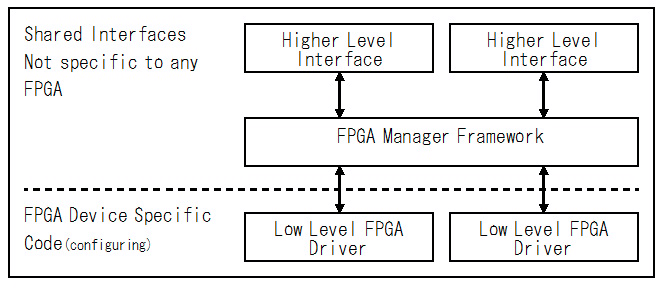

FPGA Configuration Interface for Linux FPGA Manager Framework
=============================================================


# はじめに


## Linux FPGA Manager Framework とは


Linux Kernel 4.4.4 から FPGA Manager Framework が追加されました。これはLinux から異なる種類の FPGA をコンフィギュレーションするための共通インターフェースを提供するためのものです。

FPGA Manager Framework は次の図のような構成になっています。




図1 FPGA Manager Framework

<br />

Linux Kernel 4.4.4 では、FPGA ベンダーの Xilinx 社がこのフレームワークに対応した Zynq 用の Low Level FPGA Driver を提供しています。同じく Altera 社は Altera-SoC用の Low Level FPGA Driver を提供しています。


## fpgacfgとは


現時点(2016年4月)の Linux Kernel にはFPGA Manager Framework と Zynq用のLow Level FPGA Driver と Altera-SoC 用の Low Level FPGA Driver が提供されていますが、何故か Higher Level Interface が提供されていません。したがって、現時点では FPGA のコンフィギュレーションはカーネル内部からしか行えません。

そこで、簡易的な Higher Level Interface として作ったのが fpgacfg です。このデバイスドライバを組み込むことで、ユーザー側からFPGA のコンフィギュレーションを行うことが出来るようになります。


## 対応プラットフォーム


* OS : Linux Kernel Version  4.4.4

* CPU: ARM Cortex-A9 (Zynq or Altera-SoC)


## Licensing


二条項BSDライセンス (2-clause BSD license) で公開しています。   


# 使い方


## Linux Kernel のビルド


私が FPGA Manager の動作を確認した Linux のバージョンは4.4.4です。通常は FPGA Manager オプションはオフになっているので、このオプションをオンにして Linux Kernel をビルドしておく必要があります。

具体的には make menuconfig で Device Drivers ---> FPGA Configuration Support ---> FPGA Configuration Framework をオンにするか、.config にCONFIG_FPGA=y を追加します。

また、使用する FPGA にあわせて Low Level FPGA Driver も組み込む必要があります。

Zynq の場合は、make menuconfig で Device Drivers ---> FPGA Configuration Support ---> Xilinx Zynq FPGA をオンにするか、.config に CONFIG_FPGA_MGR_ZYNQ_FPGA=y を追加します。

Altera-SoC の場合は、make menuconfig で Device Drivers ---> FPGA Configuration Support ---> Altera SOCFPGA FPGA Managerをオンにするか、.config にCONFIG_FPGA_MGR_SOCFPGA=y を追加します。


## fpgacfg のビルド


下記のようにダウンロードして、Makefile を適当に修正してコンパイルしてください。


```Shell
shell$ git clone https://github.com/ikwzm/fpgacfg.git
shell$ cd fpgacfg
shell$ make
```


## fpgacfg のインストール (Zynq)


Device Tree に次のようなエントリ(fpgacfg0)を追加します。

devcfg@f8007000 は、もともと Device Tree に追加されている Zynq 用の Low Level FPGA Driver です。

fpgacfg は、どの Low Level FPGA Driver を制御するかを指定する必要があります。ここでは、fpga-manager-path に "/amba/devcfg@f8007000" を書くことによって、devcfg@f8007000 を指定しています。


```devicetree:zynq-zybo.dts
/dts-v1/;
/ {
	:
	(中略)
	:
	amba {
		devcfg@f8007000 {
			compatible = "xlnx,zynq-devcfg-1.0";
			reg = <0xf8007000 0x100>;
			interrupt-parent = <0x3>;
			interrupts = <0x0 0x8 0x4>;
			clocks = <0x1 0xc>;
			clock-names = "ref_clk";
			syscon = <0x5>;
		};
	:
	(中略)
	:
		fpgacfg0 {
			compatible        = "ikwzm,fpgacfg-0.10.a";
			fpga-manager-path = "/amba/devcfg@f8007000";
		};
	:
	(後略)
	:

```


上記の Device Tree を使って Linux を起動した後、次のようにfpgacfg をロードします。


```Shell
zynq# insmod insmod fpgacfg.ko
[ 2699.188074] fpgacfg amba:fpgacfg0: driver probe start.
[ 2699.193477] fpgacfg amba:fpgacfg0: driver installed.
[ 2699.198361] fpgacfg amba:fpgacfg0: device name  : fpgacfg0
[ 2699.203875] fpgacfg amba:fpgacfg0: fpga manager : Xilinx Zynq FPGA Manager
```


アンインストールするには rmmod を使います。


```Shell
zynq# rmmod fpgacfg
[ 3129.269938] fpgacfg amba:fpgacfg0: driver unloaded
```


また、Device Tree Overlay を使ってインストールすることも出来ます。Device Tree Overlay を使うには、次のような Device Tree を用意します。


```devicetree:fpgacfg0.dts
/dts-v1/;
/ {
	fragment@0 {
		target-path = "/amba";
		__overlay__ {
			fpgacfg0 {
				compatible        = "ikwzm,fpgacfg-0.10.a";
				fpga-manager-path = "/amba/devcfg@f8007000";
			};
		};
	};
};

```


この Device Tree を [こちら](https://github.com/ikwzm/dtbocfg)のDevice  Tree Blob Overlay Configuration File System を使ってインストールする場合は次のようにします。


```Shell
zynq# mkdir /config/device-tree/overlays/fpgacfg0
zynq# dtc -I dts -O dtb -o /config/device-tree/overlays/fpgacfg0/stbo fpgacfg0.dts
zynq# echo 1 > /config/device-tree/overlays/fpgacfg0/status
zynq# insmod fpgacfg.ko
[ 2699.188074] fpgacfg amba:fpgacfg0: driver probe start.
[ 2699.193477] fpgacfg amba:fpgacfg0: driver installed.
[ 2699.198361] fpgacfg amba:fpgacfg0: device name  : fpgacfg0
[ 2699.203875] fpgacfg amba:fpgacfg0: fpga manager : Xilinx Zynq FPGA Manager

```


## fpgacfg のインストール (Altera-SoC)


Device Tree に次のようなエントリ(fpgacfg0)を追加します。

fpgamgr@ff706000 は、もともと Device Tree に追加されている Altera-SoC 用の Low Level FPGA Driver です。

fpgacfg は、どの Low Level FPGA Driver を制御するかを指定する必要があります。ここでは、fpga-manager-path に "/soc/fpgamgr@ff706000" を書くことによって、fpgamgr@ff706000 を指定しています。


```devicetree:zynq-zybo.dts
/dts-v1/;
/ {
	:
	(中略)
	:
	soc {
		fpgamgr@ff706000 {
			compatible = "altr,socfpga-fpga-mgr";
			reg = <0xff706000 0x1000 0xffb90000 0x1000>;
			interrupts = <0x0 0xaf 0x4>;
		};
	:
	(中略)
	:
		fpgacfg0 {
			compatible        = "ikwzm,fpgacfg-0.10.a";
			fpga-manager-path = "/soc/fpgamgr@ff706000";
		};
	:
	(後略)
	:

```


上記の Device Tree を使って Linux を起動した後、次のようにfpgacfg をロードします。


```Shell
socfpga# insmod insmod fpgacfg.ko
[  304.854598] fpgacfg soc:fpgacfg0: driver probe start.
[  304.859864] fpgacfg soc:fpgacfg0: driver installed.
[  304.864773] fpgacfg soc:fpgacfg0: device name  : fpgacfg0
[  304.870160] fpgacfg soc:fpgacfg0: fpga manager : Altera SOCFPGA FPGA Manager

```


アンインストールするには rmmod を使います。


```Shell
socfpga# rmmod fpgacfg
[  411.269938] fpgacfg soc:fpgacfg0: driver unloaded
```


また、Device Tree Overlay を使ってインストールすることも出来ます。Device Tree Overlay を使うには、次のような Device Tree を用意します。


```devicetree:fpgacfg0.dts
/dts-v1/;
/dts-v1/;
/ {
	fragment@0 {
		target-path = "/soc";
		__overlay__ {
			fpgacfg0 {
				compatible        = "ikwzm,fpgacfg-0.10.a";
				fpga-manager-path = "/soc/fpgamgr@ff706000";
			};
		};
	};
};

```


この Device Tree を [こちら](https://github.com/ikwzm/dtbocfg)のDevice  Tree Blob Overlay Configuration File System を使ってインストールする場合は次のようにします。


```Shell
socfgpa# mkdir /config/device-tree/overlays/fpgacfg0
socfpga# dtc -I dts -O dtb -o /config/device-tree/overlays/fpgacfg0/stbo fpgacfg0.dts
socfgpa# echo 1 > /config/device-tree/overlays/fpgacfg0/status
socfpga# insmod fpgacfg.ko
[  304.854598] fpgacfg soc:fpgacfg0: driver probe start.
[  304.859864] fpgacfg soc:fpgacfg0: driver installed.
[  304.864773] fpgacfg soc:fpgacfg0: device name  : fpgacfg0
[  304.870160] fpgacfg soc:fpgacfg0: fpga manager : Altera SOCFPGA FPGA Manager
```


## デバイスファイル


fpgacfgをinsmodでカーネルにロードすると、次のようなデバイスファイルが作成されます。\<device-name\>には、fpgacfg0等のデバイス名が入ります。

* /dev/\<device-name\>
* /sys/class/fpgacfg/\<device-name\>/buffer_state
* /sys/class/fpgacfg/\<device-name\>/data_buffer_size
* /sys/class/fpgacfg/\<device-name\>/data_format
* /sys/class/fpgacfg/\<device-name\>/data_store_size
* /sys/class/fpgacfg/\<device-name\>/flags
* /sys/class/fpgacfg/\<device-name\>/fpga_mgr_state
* /sys/class/fpgacfg/\<device-name\>/head_buffer_size
* /sys/class/fpgacfg/\<device-name\>/head_store_size
* /sys/class/fpgacfg/\<device-name\>/is_partial_bitstream
* /sys/class/fpgacfg/\<device-name\>/load_start
* /sys/class/fpgacfg/\<device-name\>/max_data_size

### /dev/\<device-name\>


/dev/\<device-name\>はFPGAの各種コンフィギュレーションファイルをFPGAに書き込むのに使います。


```Shell
zynq# cp design_1_wrapper.bit /dev/fpgacfg0
```


FPGAのコンフィギュレーションファイルフォーマットとしては、RBF(Raw Binary Format)か、Xilinx Bitstream Formatのどちらかを後述の /sys/class/fpgacfg/\<device-name\>/data_format で指定する事ができます。

残念ながら、FPGA Manager の仕様上、FPGAのコンフィギュレーションデータをリードバックすることは出来ません。


### /sys/class/fpgacfg/\<device-name\>/data_format


このファイルはFPGAコンフィギュレーションファイルのフォーマットを指定します。

このファイルに0を書くことで、RBF(Raw Binary Format)を指定します。

このファイルに1を書くことで、Xilinx Bitstream Format を指定します。

このファイルを読むことで、現在設定されているフォーマットが判ります。

当然ですが、Xilinx Bitstream Format はXilinx社製の FPGA でしか使えません。RBF(Raw Binary Format) はAltera社製 FPGA  でも Xilinx 社製 FPGA でも使えます。


### /sys/class/fgpacfg/\<device-name\>/max_data_size


max_data_size はFPGA コンフィギュレーションファイルフォーマットがRBF(Raw Binary Format)の場合に、ファイルのバイト数を指定します。

ファイルのバイト数を指定する理由は、FPGA Manager はメモリ上にコンフィギュレーションデータが全て展開されてからで無ければFPGAのコンフィギュレーションを行いません。そのために一度カーネル内部のバッファにコンフィギュレーションデータを蓄えます。Raw Binary Format はファイル内にデータの大きさの情報が無いので、どのくらいバッファを用意しなければならないか判りません。そこで、max_data_size で確保するバッファの大きさを指定する必要があるのです。

Xilinx Bitstream Format の場合は、ヘッダ部にデータのサイズがあるので、max_data_size を指定する必要はありません。


```Shell
zynq# ls -la
rwxr-xr-x  2 ichiro ichiro    4096  4月 13 13:46 .
drwxr-xr-x 21 ichiro ichiro    4096  4月  8 05:42 ..
-rw-r--r--  1 ichiro ichiro 2083776  4月 12 14:26 design_1_wrapper.bin
zynq# echo 2083776  >/sys/class/fpgacfg/fpgacfg0/max_data_size
zynq# cat /sys/class/fpgacfg/fpgacfg0/max_data_size
2083776
zynq# cp design_1_wrapper.bin >/dev/fpgacfg0
```


### /sys/class/fpgacfg/\<device-name\>/load_start


FPGAコンフィギュレーションデータをFPGAにロードする事を指定します。

このファイルに1を書くことで、ロードを開始します。

このファイルに0を書いておくことで、ロードを遅らせることが出来ます。例えば次のように、あらかじめ /sys/class/fpga/\<device-name\>/load_startに0を書いておいてから、/dev/\<device-name\> にFPGAコンフィギュレーションデータを書き込んだ場合、すぐにはFPGAのロードを行いません。この後、/sys/class/fpgacfg\<device-name\>/load_start に1を書き込んだ時点で FPGA のロードを開始します。


```Shell
zynq# echo 0 > /sys/class/fpgacfg/fpgacfg0/load_start
zynq# cp design_1_wrapper.bin >/dev/fpgacfg0
zynq# cat /sys/class/fpgacfg/fpgacfg0/buffer_state
data fill
zynq# echo 1 > /sys/class/fpgacfg/fpgacfg0/load_start
zynq# cat /sys/class/fpgacfg/fpgacfg0/buffer_state
done
```


また、あらかじめ/sys/class/fpgacfg/\<device-name\>/load_start に1を書いておいてから、/dev/\<device-name\> にFPGAコンフィギュレーションデータを書き込んだ場合、すぐにはFPGAのロードを開始します。


```Shell
zynq# echo 1 > /sys/class/fpgacfg/fpgacfg0/load_start
zynq# cp design_1_wrapper.bin >/dev/fpgacfg0
zynq# cat /sys/class/fpgacfg/fpgacfg0/buffer_state
done
```


### /sys/class/fpgacfg/\<device-name\>/is_partial_bitstream


FPGA コンフィギュレーションデータが Partial Reconfiguration 用かどうかを指定します。このファイルに1を書くことで、Partial Reconfiguration 用であることを指定します。

Partial Reconfiguration は、現時点では Xilinx 社製の FPGA にしか対応していません。と言っても、Partial Reconfiguration を行うには別途に有償のライセンスが必要なため、現時点では動作を確認していません。

Altera 社製の Low Level FPGA Driver は対応していないようでした。


### /sys/class/fpgacfg/\<device-name\>/flags


FPGA Manager に渡す各種フラグを指定します。とは言っても、現時点で有効なフラグは Xilinx社製FPGA 用の Partial Reconfiguration がBit0 に割り当てられているだけのようです。


### /sys/class/fpgacfg/\<device-name\>/buffer_state


現在のバッファの状態を示します。主にデバッグ用です。書き込みはできません。次の文字列が読めます。

  * "none"
  * "empty"
  * "header store"
  * "data store"
  * "data fill"
  * "fpga load"
  * "done"
  * "error"


### /sys/class/fpgacfg/\<device-name\>/fpga_mgr_state


現在のFPGA Managerの状態を示します。主にデバッグ用です。書き込みはできません。次の文字列が読めます。

  * "unknown"
  * "power off"
  * "power up"
  * "reset"
  * "firmware request"
  * "firmware request error"
  * "write init"
  * "write init error"
  * "write"
  * "write error"
  * "write complete"
  * "write complete error"
  * "operating"


